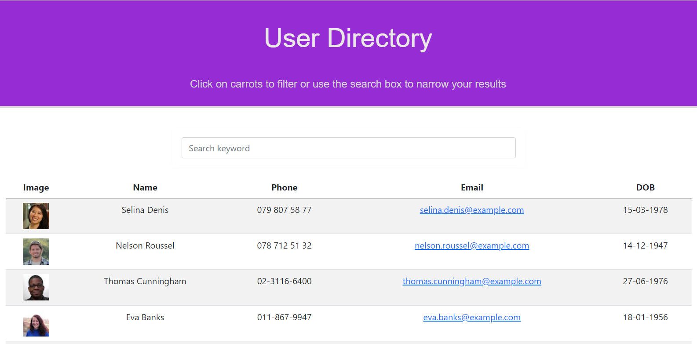

# User Directory

[](https://opensource.org/licenses/MIT)

## Description  
A simple user directory with search and filtering features.

**Live URL :** https://riheelh.github.io/user-directory/




## Table of Contents

- [Used-Technologies](#Used-Technologies)<br>
- [Installation](#Installation)<br>
- [Usage](#Usage)<br>
- [License](#License)<br>
- [Questions](#Questions)


## Used-Technologies
- React
- RandomUser API
- Bootstrap


## Installation  
- clone the project
- Open terminal
- change directory to the project directory
- run below: <br>
```
npm i
```

## Usage 
- Open
- change directory to the project directory
- run below: <br>
```
npm start
```
## License

[MIT](https://opensource.org/licenses/MIT)


## Questions
Github: [@riheelh](www.github.com/riheelh) <br>

